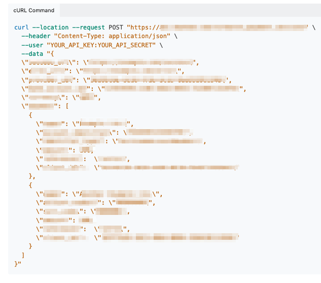
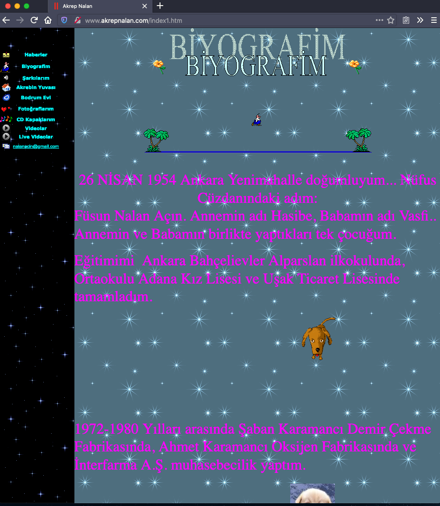
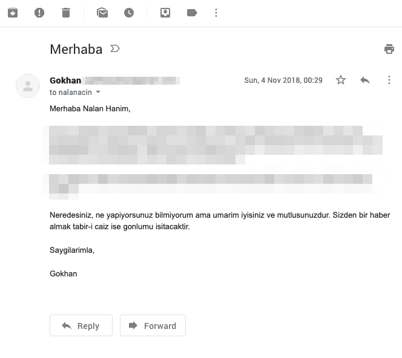
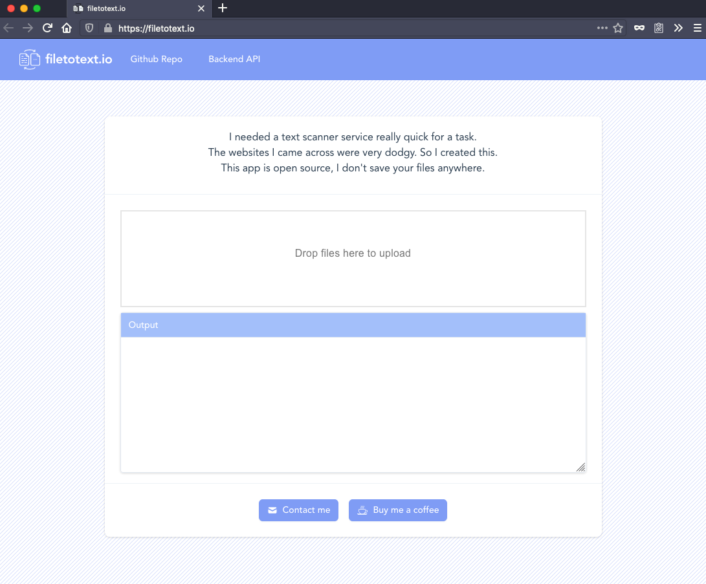

[Live Project Link](https://filetotext.arkan.me/) |
[GitHub Repo](https://github.com/gokhj/filetotext/) |
[Backend](https://github.com/gokhj/api.filetotext-api/)

This README is the copy of [my blog post](https://gokhanarkan.com/filetotext/). Use accordingly!

A couple of weeks ago, a colleague and I needed a tool to export text from some images. The images were containing long cURL request codes about the backend of a product that we are building together. This was a report generated from a cybersecurity company where they pointed out some issues and vulnerabilities regarding the APIs we built. It was all good, we met in terms, and the fix session was started.

There was a minor setback, since all code was actually pasted on the PDF as images, we could not copy it quickly.

As a somewhat lazy person, I thought about rewriting them one by one. However, some of the requests were not easy to rewrite because they were too long and complicated so we needed the help of optical character recognition technology so that we can reproduce the code to see what are we getting from the specific endpoints.

This was all when it started; I searched “free OCR service” on Google; the results were not satisfactory. You can easily imagine what sort of websites I came across. The kinds of that have multiple download buttons… They reminded me the page of Save Walter White.

Speaking of Save Walter White website, this instance also reminded me of Akrep Nalan's personal website. Akrep Nalan was used to be a Turkish TV celebrity who played a teacher role in a wildly popular TV series called Hayat Bilgisi. She was also a singer. Before then she was actually working as an accountant for a small company, but with her luck one day she won the jackpot in horse racing. Hence, she followed her dreams since she does not need to worry about her finances anymore.

According to a myth, before even the internet was a thing, she sold a flat in Istanbul and build her personal website. Apparently, people can get inspired and see the importance of the internet in their lives. I am talking about circa 2000.

Here is her website, untouched from the early 2000s.

Oh, fun fact: Akrep means Scorpion. Akrep was the horse's name which came first, so newspapers headlined her Akrep Nalan, and she embraced that name afterwards.

You can check the said website [here](http://www.akrepnalan.com/){:target="\_blank"}.

Back in 2018, I sent an email to Akrep Nalan; sadly I have never received a response.

The context of the email is essentially saying hi and how is she doing.

I finished the email with this sentence: "I don't know where are you and what are you doing nowadays. I sincerely hope that you're happy and okay. Getting a response from you would literally warm my heart. Kind regards."

Now I am wondering about why I finished this email so emotionally for a random person. Songs are always effected my headspace instantly and as far as I remember, I was listening to Green Gloves by The National.

<iframe src="https://open.spotify.com/embed/track/0EI0bOj38coiFWWAq0XlhF" width="300" height="80" frameborder="0" allowtransparency="true" allow="encrypted-media" style="margin:auto;padding:auto;"></iframe>

 

What is this song about? According to their writers:

"It’s more about trying to remember someone and sort of be them—someone that you’ve lost your connection with (maybe because of a death)—so you reconnect with them by getting inside their clothes, watching their videos, getting in their bed. You’re actually recreating them somehow in order to know them better. You miss them so much you have to become them."

Obviously, my thoughts were not on par with the feelings explained above, but all in all, it's a great song. Just wanted to squeeze this in.

Anyway, where were we? Yeah, OCR websites.

They were incredibly dodgy. I didn't want to use them at all costs. So, I created a little node function to use the AWS SDK and build a bridge between me and the AWS Textract service. I was lucky because I knew what service to call, how to code stuff etc. And I asked myself, what about the people in the same boat? Can I build something easy to use for them? If I can, then why not?

That was my motivation. I want to add one more thing before concluding this post.

<iframe width="560" height="315" src="https://www.youtube-nocookie.com/embed/BxV14h0kFs0" frameborder="0" allow="accelerometer; autoplay; clipboard-write; encrypted-media; gyroscope; picture-in-picture" style="margin:auto;padding:auto;" allowfullscreen></iframe>

 

Some footnotes of the above video:

> "Sooner or later, the server you're hosting your code on will fail, or there'll be a security patch that you'll have to install or technology will move on enough that you'll need to update and rewrite the whole thing, and you will have to ask yourself the question: is it actually worth it?"

> "My code eventually will break. Eventually, so will YouTube, so will everything."

> "Entropy, the steady decline into disorder, is a fundamental part of the universe, entropy will get us all in the end."

Indeed, the entropy will get us all. Everything will break or die in the end. However, this should not mean we should not develop things. If I have any effect on anyone's life, even with this little project, this might somehow last into the future in a different way.

#### Boring stuff

I designed the API using Node and Express quickly. It doesn’t include any complicated features, so the actual development didn’t take more than an hour. I added the Tesseract library for the future. The system currently uses the Textract as its primary text extraction service.

Then I started developing the UI. The interface needs to look reliable, easy to use and visually appealing. I did some experiments; put some buttons here and there, tried to make the application as universal as possible so anyone can interact and use it.

I used Vue as the main application framework. I believe Vue is an effortless and fun way to prototype things. I also used Tailwind for the main CSS library.

I then concluded to use Dropzone.js as the to-go part of the file handling. I had to cut down some features since Dropzone.js is coming multi-file registry.

As a further change, I removed the form status of the file upload facility. I just didn’t want to add a submit button, the application needed to start processing the file immediately when the user dragged the file. It will show you the text as quickly as possible without further interaction.

This is the current product:

#### What's next?

I don't know the future of this project. I may go and improve/modify the backend depending on my needs. There are some limitations I deliberately put, such as file type or size limitations. I would love to extend these, and maybe I can add more language options. Implementing a file compression algorithm would also make the system a bit faster too. However, its speed is more than enough at the moment.

For all I know, this service is public and free. You can use the client interface as many times as you want. The API is also public if anyone needs a free text extracting service.

Take care and have a lovely day/afternoon/evening.
